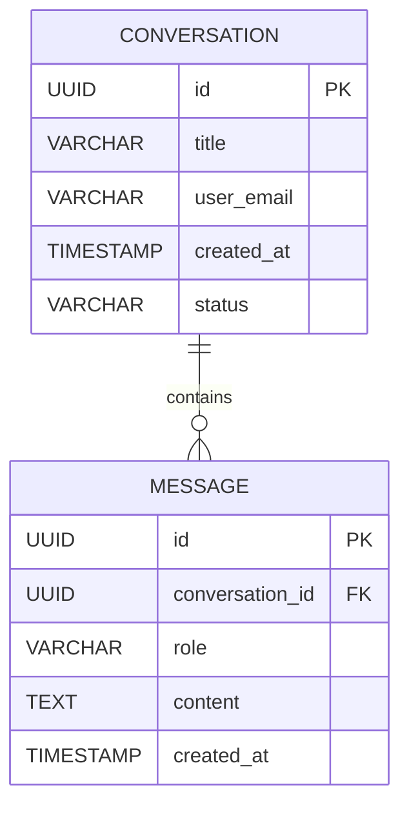

# Jarvis 3.0 - Arquitetura de Banco de Dados

A persistência de dados no Jarvis 3.0 é estruturada com **SQLAlchemy 2.0 (Async)** e **Alembic**, fornecendo armazenamento relacional para sessões de chat, histórico de mensagens e preferências do usuário.

---

## 1. Estratégia de SGBD

*   **Ambiente de Desenvolvimento**: Banco **SQLite** assíncrono (`sqlite+aiosqlite:///./jarvis_db.sqlite3`). Não exige serviço externo ou instalação de SGBD adicional.
*   **Ambiente de Produção**: **PostgreSQL** assíncrono (`postgresql+asyncpg://...`). Mudança realizada via variável de ambiente `DATABASE_URL`.

---

## 2. Modelo de Dados (Schema)



### Mapeamento ORM SQLAlchemy em Python:

```python
import uuid
from datetime import datetime
from sqlalchemy import String, Text, DateTime, ForeignKey, Index
from sqlalchemy.orm import DeclarativeBase, Mapped, mapped_column, relationship
from sqlalchemy.dialects.postgresql import UUID

class Base(DeclarativeBase):
    pass

class Conversation(Base):
    __tablename__ = "conversations"

    id: Mapped[str] = mapped_column(String(36), primary_key=True, default=lambda: str(uuid.uuid4()))
    title: Mapped[str] = mapped_column(String(255), nullable=False)
    user_email: Mapped[str] = mapped_column(String(255), nullable=False, index=True)
    created_at: Mapped[datetime] = mapped_column(DateTime, default=datetime.utcnow, nullable=False)
    status: Mapped[str] = mapped_column(String(50), default="ACTIVE", nullable=False)

    messages: Mapped[list["Message"]] = relationship("Message", back_populates="conversation", cascade="all, delete-orphan")

class Message(Base):
    __tablename__ = "messages"

    id: Mapped[str] = mapped_column(String(36), primary_key=True, default=lambda: str(uuid.uuid4()))
    conversation_id: Mapped[str] = mapped_column(String(36), ForeignKey("conversations.id", ondelete="CASCADE"), nullable=False, index=True)
    role: Mapped[str] = mapped_column(String(50), nullable=False)
    content: Mapped[str] = mapped_column(Text, nullable=False)
    created_at: Mapped[datetime] = mapped_column(DateTime, default=datetime.utcnow, nullable=False)

    conversation: Mapped["Conversation"] = relationship("Conversation", back_populates="messages")
```

---

## 3. Versionamento com Alembic

O versionamento de banco de dados no Jarvis 3.0 é gerenciado pelo **Alembic** (equivalente em Python ao Flyway/Liquibase).

### Comandos Principais:
```bash
# Gera uma nova migração baseada nas alterações das classes ORM
alembic revision --autogenerate -m "criar tabelas conversation e message"

# Aplica as migrações no banco de dados ativo
alembic upgrade head
```
