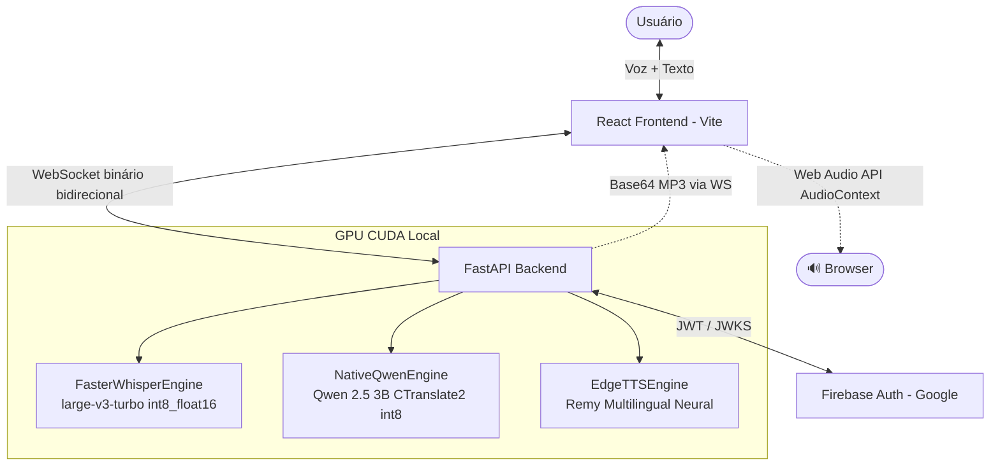

# Jarvis 3.0 — Visão Geral da Arquitetura

O Jarvis 3.0 roda **100% localmente** na máquina do usuário. Toda a pipeline de IA processa na **GPU CUDA local** sem chamadas a APIs externas. O acesso à interface web é protegido por Firebase Authentication.

---

## 1. Diagrama de Componentes



---

## 2. Fluxo de uma Interação por Voz

```
[Microfone do Browser]
       │ PCM 16-bit Mono 16kHz (chunks 200ms via WebSocket)
       ↓
[BackendVADDetector]  ← threshold RMS + janela de silêncio
       │ (pausa detectada após fala)
       ↓
[FasterWhisperEngine]  — large-v3-turbo, CUDA, int8_float16
  ├── detect_language(audio)  →  {pt: 0.92, en: 0.05, ...}
  ├── força idioma a PT ou EN  (ALLOWED_LANGUAGES = {"pt", "en"})
  ├── transcribe(language=forced_lang, vad_filter=True, ...)
  └── HallucinationFilter.clean_text()  →  filtra "Thank you", ruído, etc.
       │ texto limpo + detected_lang
       ↓
[NativeQwenEngine]  — Qwen 2.5 3B, CTranslate2, CUDA, int8_float16
  ├── system_prompt + instrução de idioma forçado
  └── generate_stream()  →  tokens em streaming via WebSocket (llm_chunk)
       │ resposta completa
       ↓
[EdgeTTSEngine]  — fr-FR-RemyMultilingualNeural
  └── synthesize(text)  →  MP3 bytes  →  Base64  →  WebSocket (tts_audio)
       │
       ↓
[AudioContext no Browser]  →  🔊 Fala no dispositivo cliente
```

---

## 3. Payloads WebSocket

### Backend → Frontend

| type | Campos | Descrição |
|---|---|---|
| `stt_status` | `status: "transcribing"` | Whisper iniciou transcrição |
| `stt_result` | `text, user, language` | Texto final transcrito + idioma detectado |
| `partial_stt` | `text` | Transcrição parcial em tempo real |
| `llm_status` | `status: "generating"` | Qwen iniciou geração |
| `llm_chunk` | `text` | Token de streaming do LLM |
| `llm_result` | `text` | Resposta completa do LLM |
| `tts_audio` | `audio: "<base64_mp3>"` | Áudio sintetizado (MP3 em Base64) |

### Frontend → Backend

| Formato | Descrição |
|---|---|
| `bytes` (binário) | Chunk de áudio PCM 16-bit Mono 16kHz |
| `{"type": "text_message", "text": "..."}` | Mensagem digitada pelo usuário |

---

## 4. Endpoints REST

| Método | Rota | Descrição |
|---|---|---|
| `GET` | `/` | Status geral do backend |
| `WS` | `/ws/voice?token=JWT` | WebSocket bidirecional de voz |
| `GET` | `/api/health` | VRAM, temperatura, carga CUDA, latências STT/LLM/TTS |
| `POST` | `/api/health/gc` | Coleta de lixo forçada + limpeza de VRAM |

---

## 5. Uso de VRAM (RTX 3060 12GB)

| Modelo | VRAM |
|---|---|
| Whisper Large-v3-Turbo (int8_float16) | ~1.5 GB |
| Qwen 2.5 3B int8 (CTranslate2) | ~1.9 GB |
| **Total Jarvis** | **~3.4 GB** |
| Windows WDDM (Chrome, Discord, IDE...) | ~7–8 GB |
| **Total típico** | **~11–12 GB** |

> O alto consumo de VRAM vem do Windows WDDM e apps gráficos (Chrome, Discord, Edge), não dos modelos de IA.

---

## 6. Requisitos

- **Python 3.12** com CUDA toolkit compatível (CUDA 13.x, driver 591+)
- **Node.js 18+** para compilação do frontend React/Vite
- **NVIDIA GPU** com 8GB+ VRAM (testado: RTX 3060 12GB)
- **Firebase Project** configurado com Google Sign-In ativo
- **Conexão à internet** apenas para TTS (Edge-TTS usa API da Microsoft) e autenticação Firebase
