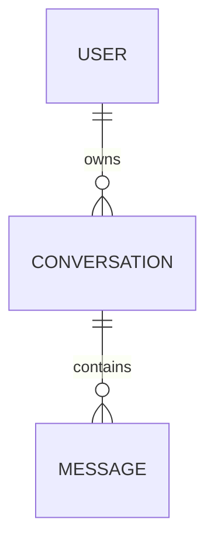

# Módulo de Usuários (User Domain)

Como o Jarvis 3.0 é um assistente pessoal local e privado, o escopo deste módulo é focado na autorização e personalização do usuário autenticado no backend FastAPI.

---

## 1. Responsabilidades

*   Gerenciar a identidade do usuário logado baseado nas informações do Firebase ID Token.
*   Garantir o isolamento de dados (multitenancy simples por e-mail): garantir que conversas e mensagens sejam vinculadas estritamente ao e-mail de quem as criou.
*   Carregar as preferências do usuário (como voz preferida da síntese TTS, temperatura do modelo, etc.).

---

## 2. Isolamento de Dados (Conversas por Usuário)

Embora o sistema seja executado em rede local privada, o banco de dados suporta multitenancy simples baseado no e-mail do usuário autenticado. Isso garante que se outro e-mail autorizado da whitelist (ex: `gbbts@gmail.com`) se conectar ao Jarvis, ele não tenha acesso ao histórico de conversas do administrador principal (`batistell.labs@gmail.com`).

### Regra de Consulta em SQLAlchemy:
Todas as buscas de conversas filtradas na tabela `conversations` incluem a cláusula `.where(Conversation.user_email == current_user_email)`, onde `current_user_email` é injetado como dependência do FastAPI (`Depends(get_current_user_email)`).
