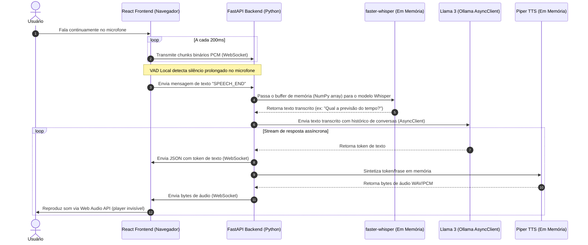
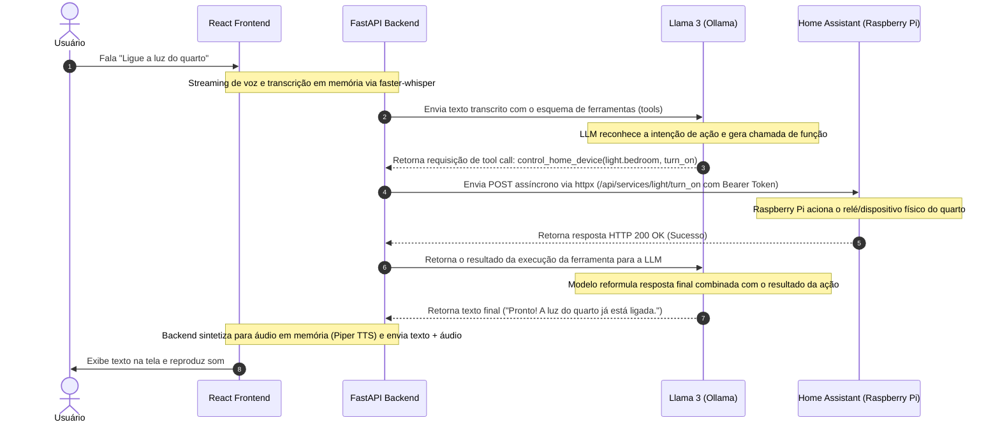

# Processos e Fluxos de Controle (Workflows)

Este documento mapeia os fluxos operacionais detalhados do **Jarvis 3.0**, conectando os componentes físicos, APIs assíncronas do FastAPI e bibliotecas nativas em Python.

---

## 1. Loop de Voz Contínuo (Always-Listening Loop)

Este processo descreve como o sistema captura a voz do usuário em tempo real na rede local, transcreve com `faster-whisper` nativo em memória, processa na LLM via Ollama e retorna o áudio sintetizado com `piper-tts`.

---

## 2. Fluxo de Execução de Automação Residencial (Tool Use / Function Calling)

Este processo descreve as chamadas de ferramentas dinâmicas disparadas pela inteligência artificial do Llama 3 para acionar lâmpadas e sensores integrados ao Home Assistant no Raspberry Pi.

